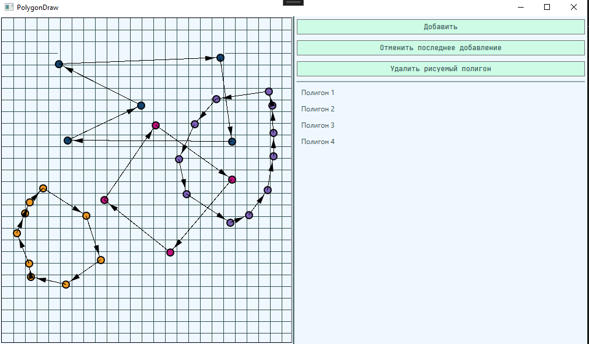
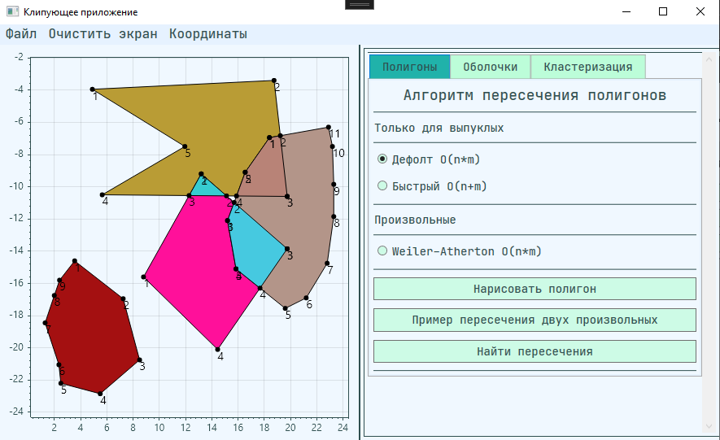
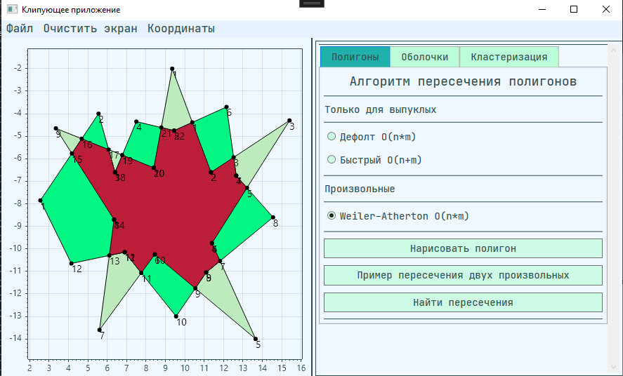
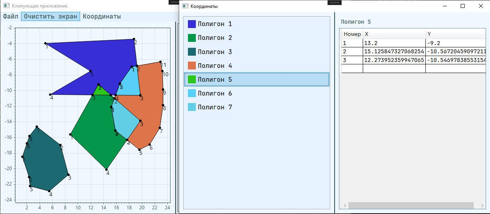
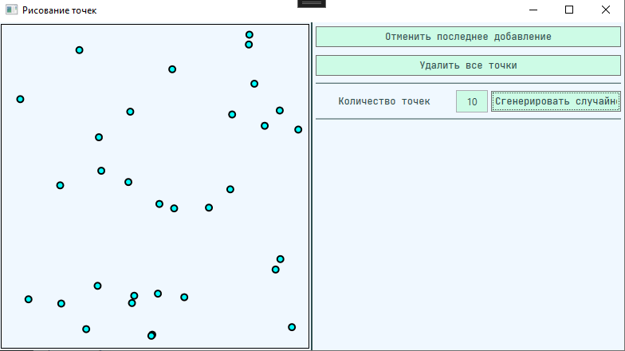
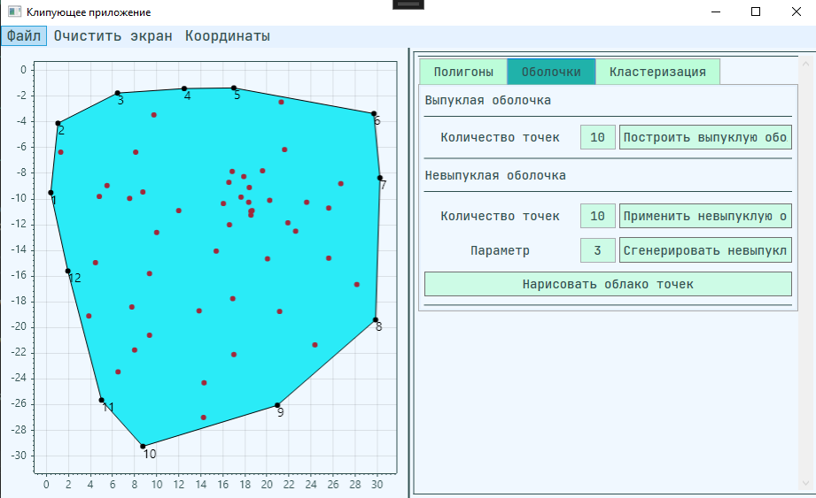
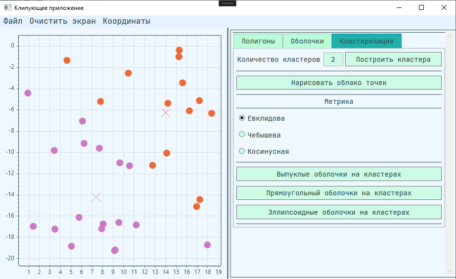
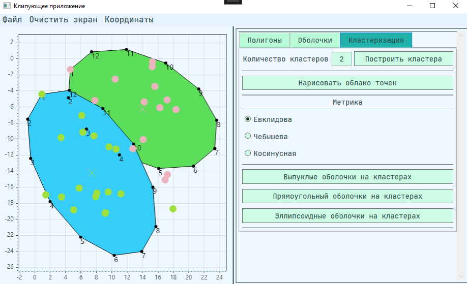
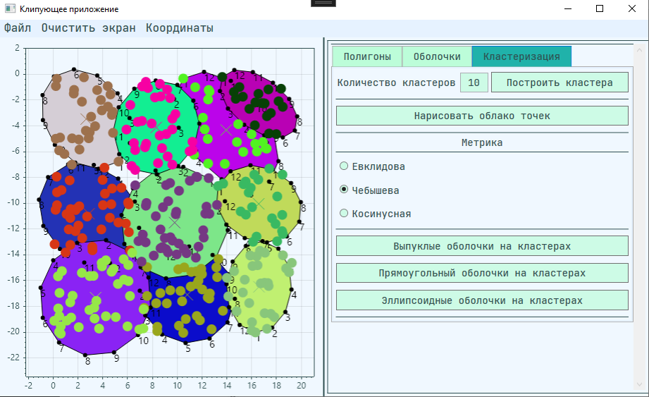
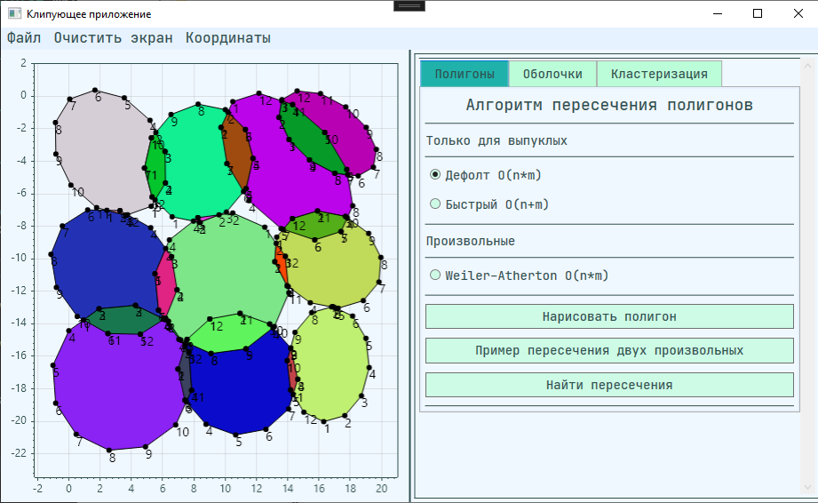

# Clipping app (aka Клипующее приложение)

Приложение для демонстарции работы алгоритмов нахождения пересечений, построения выпуклых/невыпуклых оболочек и кластеризации.

Реализованные алгоритмы:

Пересечения многоугольников
* Convex polygon clipper код | [объяснение](./Core/Clippers/ConvexPolygonClipper/ConvexPolygonClipper.md)
* O`Rourke polygon clipper код | [объяснение](./Core/Clippers/RourkeChienPolygonClipper/RourkeChienPolygonClipper.md)
* Weiler-Atherton polygon clipper код | [объяснение](./Core/Clippers/WeilerAthertonPolygonClipper/WeilerAthertonPolygonClipper.md)

Кластеризация алгоритмом K-means с метриками:

* Евклидова
* Чебышева
* Косинусная

Построениe оболочек:

* QuickHull - выпуклые оболочки код | объяснение
* алгоритм Пугачёва - невыпуклые Оболочки код | объяснение

---

## Функционал приложения:

Окно для рисования полигонов:

Нахождения пересечений полигонов как выпуклых, так и невыпукых

Для пересечения невыпуклых важно, чтобы вершины располагались по часовой стрелке

Также в окне "Координаты" можно посмотреть координаты полученных многоугольников

Доступно окно для рисования точек для демонстрации алгоритмов кластеризации / построения оболочек

На полученный набор точек можно натянуть выпуклую оболочку или построить кластера

На полученные кластера можно натянуть эллипсы / прямоугольники / выпуклые оболочки

А после найти пересечения полученных фигур

