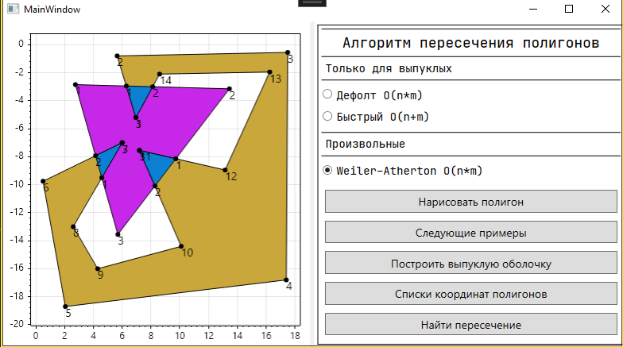

# Clipping app

Я разрабатываю это приложения для тестирования алгоритмов нахождения пересечений многоугольников как выпуклых, так и произвольных.

Уже сейчас реализованы алгоритмы:
1. Convex polygon clipper [алгоритм](./Core/Clippers/ConvexPolygonClipper/ConvexPolygonClipper.md)
1. O`Rourke polygon clipper [алгоритм](./Core/Clippers/RourkeChienPolygonClipper/RourkeChienPolygonClipper.md)
1. Weiler-Atherton polygon clipper [алгоритм](./Core/Clippers/WeilerAthertonPolygonClipper/WeilerAthertonPolygonClipper.md)

Также можно найти реализацию алгоритма quickhull
---

